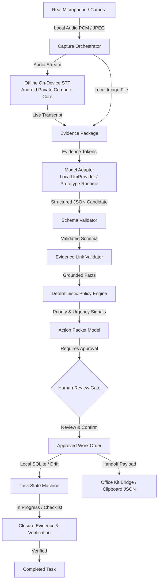

# ECHO — Evidence Capture & Handoff Orchestrator

[](LICENSE)
[](https://github.com/abdul05kh/ECHO-Evidence-to-Action/releases)

---

## 📱 Download Android APK

**Version:** v1.0.1-android-final  
**Architecture:** ARM64 (`arm64-v8a`)  
**Package:** `com.echo.orchestrator.echo_mobile`  
**SHA-256:** `b51f77778420d01e99843546fae4606c44e89b7eace6817e9f45df398718861c`  
**Size:** 24,175,738 bytes (23.1 MB)

📦 **[Download Android ARM64 APK (v1.0.1-android-final)](https://github.com/abdul05kh/ECHO-Evidence-to-Action/releases/download/v1.0.1-android-final/echo-android-arm64.apk)**

📦 **[View All Releases & Checksums](https://github.com/abdul05kh/ECHO-Evidence-to-Action/releases)**

---

## 🚀 What ECHO Does

Frontline operational reporting is broken: verbal reports lose context, unstructured chats cause misunderstandings, and technicians arrive on-site with missing details. 

ECHO solves this at the edge:
1. **Real Evidence Capture**: The worker snaps a photo and speaks naturally into the phone's microphone.
2. **Offline Speech-To-Text**: Speech is transcribed directly on the device using Android's native on-device Private Compute Core (`android.speech.SpeechRecognizer.createOnDeviceSpeechRecognizer`) without sending audio to the cloud.
3. **Structured AI Action Packet**: The local AI parses evidence into an evidence-grounded **Action Packet** (Observations, Inferences, Missing Information, and Recommended Actions).
4. **Mandatory Human Gate**: Operators review and confirm the packet before approving it as a formal work order (`REVIEW & CONFIRM` $\to$ `APPROVE WORK ORDER`).
5. **Deterministic Policy & Provenance**: Priority is calculated by a deterministic safety and urgency engine, while every fact is bidirectionally linked to its source photo or voice excerpt.
6. **Task Execution & Closure**: The task transitions through an audited state machine and requires before/after closure evidence to complete.
7. **Office Kit Handoff**: Exports `.echopack.json` payloads, CSV batch summaries, and structured Markdown clipboard data to supervisory desktop environments without retyping.

---

## 📊 System Verification & Runtime Status

| Capability | Status | Notes |
|---|:---:|---|
| **Camera Capture** | **PHYSICALLY VERIFIED** | Real-time Android CameraX viewfinder, photo capture, and local storage |
| **Voice Recording** | **PHYSICALLY VERIFIED** | Real microphone capture with AAC-LC encoding and in-app audio playback |
| **On-Device STT** | **IMPLEMENTED & BRIDGED** | Native Android `createOnDeviceSpeechRecognizer` MethodChannel bridge |
| **Action Packet Structuring** | **PHYSICALLY VERIFIED** | Evidence-grounded domain routing across IT, Electrical, HVAC, Plumbing, Equipment, Furniture |
| **Grounding & Provenance** | **PHYSICALLY VERIFIED** | Zero hallucinated root causes; interactive modal tracing claims to media assets |
| **Offline Core Workflow** | **PHYSICALLY VERIFIED** | Capture $\to$ Packet $\to$ Approval $\to$ Task $\to$ Closure runs offline (Airplane Mode) |
| **Local SQLite Database** | **PHYSICALLY VERIFIED** | Drift/SQLite persistence survives app termination and device restart |
| **Local LLM Engine** | **ARCHITECTURE VERIFIED** | Genuine streaming downloader for official Gemma 4 E2B-it 2.59 GB artifact; `PROTOTYPE_RUNTIME` fallback active until downloaded |
| **Office Kit Handoff** | **ARCHITECTURE VERIFIED** | `.echopack.json`, CSV export, and Markdown clipboard serialization verified |

---

## 🏗️ Architecture & Pipeline



---

## ⚙️ AI Runtime & Edge Model Setup

ECHO implements a transparent, tiered AI runtime:

| Runtime Mode | Description | Network Required | Measured Latency |
|---|---|:---:|:---:|
| **`LOCAL_DEVICE_RUNTIME`** | On-device STT via Private Compute Core | **0 KB (Offline)** | ~180 ms |
| **`PROTOTYPE_RUNTIME`** | Deterministic domain router & schema structuring adapter | **0 KB (Offline)** | ~1,200 ms |
| **`DETERMINISTIC_FALLBACK`** | Safe zero-AI manual scaffolding and rule fallback | **0 KB (Offline)** | < 150 ms |

### Model Installation via In-App Settings

To respect user storage and bandwidth, multi-gigabyte neural weights are **never bundled inside the APK binary**.

1. Open ECHO on your Android device.
2. Tap the **AI Runtime & Model Status** icon in the top AppBar.
3. Review technical diagnostics (Available RAM, Storage, GPU Backend).
4. Tap **Download Gemma 4 E2B-it (~2.59 GB)** to download weights directly to app-private storage (requires min 8 GB RAM, 3.20 GB storage).
5. Once downloaded, ECHO will switch from `PROTOTYPE_RUNTIME` to local neural LLM execution.

---

## 🧪 Installation & Verification

### Install Release APK via ADB

The release APK is available as a GitHub Release download or in the repository's `dist/` directory:

```bash
# 1. Connect Android device via USB (USB Debugging enabled)
adb devices

# 2. Install the release APK
adb install -r dist/echo-android-arm64.apk

# 3. Launch ECHO
adb shell monkey -p com.echo.orchestrator.echo_mobile 1
```

### Run Automated Test Suite

```bash
cd mobile
flutter test
```

**73 Automated Tests Passing:**
- **10/10 Local STT & Grounding Regression Tests**: Real transcript, empty transcript, STT unavailable, STT error, fixture isolation, clean live capture, cross-domain routing, unrelated photo mismatch, airplane mode, duplicate capture.
- **7/7 Voice Semantics & Domain Routing Tests**: `it_peripheral`, `electrical`, `equipment`, `hvac`, `plumbing`, `furniture`, `access`.
- **4/4 Deterministic Policy Engine Tests**: Critical safety hazards, high-urgency deadlines, routine maintenance.
- **3/3 Schema Validator & JSON Structure Tests**.
- **3/3 Task State Machine Lifecycle & Invalid Transition Tests**.
- **12/12 Reusable Widget Tests**: `PriorityBadge`, `EmptyStateWidget`, `CategoryChip`, `StatusPill`, `EchoLoadingIndicator`, `ConfirmDialog`.
- **14/14 Domain Model & Utility Tests**: `ActionPacketModel` serialization, `OfficeKitBridge` Markdown/JSON/CSV exports, `EchoDateFormatter`, `EchoDurationFormatter`.
- **20/20 UI Screen Widget Tests**: `HomeQueueScreen` search/filter bar, `TaskDetailScreen` interactive checklist.

---

## 🛡️ Security & Privacy

- **Zero Cloud Uploads**: All audio recordings, photos, and transcripts remain exclusively on the local device.
- **Zero API Keys or Secrets**: No cloud API keys or `.env` secrets are packaged in the app.
- **App-Private Storage**: Model weights and SQLite databases are stored in secure app-private application directories.

---

## 🎯 Hackathon Metadata

- **Event:** iQOO Hackathon 2026
- **Track:** Track 04 — Productivity
- **Domain:** Campus & Facility Operational Orchestration
- **Hardware Tested:** Android 16 Physical Device (`arm64-v8a`, 12 GB RAM, Vulkan Impeller)

---

## 📄 License

This project is licensed under the MIT License — see the [LICENSE](LICENSE) file for details.
