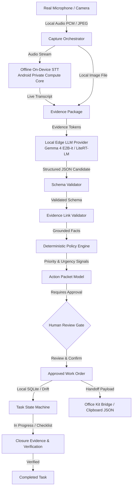

# ECHO — Evidence Capture & Handoff Orchestrator

> **Turn what a frontline operator sees and says into a verified, evidence-grounded unit of work — on the phone, offline, and ready for immediate execution.**

[](https://github.com/abdul05kh/ECHO-Evidence-to-Action/actions/workflows/ci.yml)
[](LICENSE)
[](https://github.com/abdul05kh/ECHO-Evidence-to-Action/releases)

---

## 📱 Android APK Download

Direct download for the physical Android ARM64 release package:

👉 **[Download Latest Android ARM64 APK (v1.0.0)](https://github.com/abdul05kh/ECHO-Evidence-to-Action/releases/latest/download/echo-android-arm64.apk)**

Or view all release assets on the [Releases Page](https://github.com/abdul05kh/ECHO-Evidence-to-Action/releases).

---

## 🎯 What ECHO Does

Frontline operational reporting is broken: verbal reports lose context, unstructured chats cause misunderstandings, and technicians arrive on-site with missing details. 

ECHO solves this at the edge:
1. **Real Evidence Capture**: The worker snaps a photo and speaks naturally into the phone's microphone.
2. **Offline Speech-To-Text**: Speech is transcribed directly on the device using Android's on-device Private Compute Core without sending audio to the cloud.
3. **Structured AI Action Packet**: The local AI parses evidence into an evidence-grounded **Action Packet** (Observations, Inferences, Missing Information, and Recommended Actions).
4. **Mandatory Human Gate**: Operators review and confirm the packet before approving it as a formal work order.
5. **Deterministic Policy & Provenance**: Priority is calculated by a deterministic safety and urgency engine, while every fact is bidirectionally linked to its source photo or voice excerpt.
6. **Task Execution & Closure**: The task transitions through an audited state machine and requires before/after closure evidence to complete.
7. **Office Kit Handoff**: Exports `.echopack.json` payloads to supervisory desktop environments without retyping.

---

## 🏗️ Architecture & Pipeline



---

## ✨ Key Features

- **Phone-First Native Capture**: Built with Flutter 3.38+ and native Android Kotlin bridge for low-latency camera preview and hardware audio recording.
- **Offline On-Device STT**: Live microphone speech transcription utilizing Android Private Compute Core / `android.speech.RecognitionService` (Airplane Mode verified).
- **Edge LLM Provider Abstraction**: Supports Google Gemma 4 E2B-it via LiteRT-LM (OpenCL GPU / NNAPI backend) with app-private model storage.
- **Evidence Provenance Trace**: Interactive provenance modal linking every claim back to exact photo assets or voice recording excerpts.
- **Zero Hallucination Guard**: Visual observations only assert details visibly present in captured photos; unsupported claims are downgraded to missing information or unverified visual flags.
- **Strict Light Operational Theme**: High-contrast, clean enterprise design system (`#F7F9FC` canvas, `#FFFFFF` surface, `#0F172A` slate text, `#E5A000` gold accents, `#2563EB` action blue).
- **Task State Machine**: Complete lifecycle state machine enforcing valid transitions: `Draft` $\to$ `Processing` $\to$ `NeedsReview` $\to$ `Ready` $\to$ `Approved` $\to$ `Assigned` $\to$ `InProgress` $\to$ `Blocked` $\to$ `Completed` $\to$ `Reopened`.
- **Closure Evidence**: Strict closure requirement requiring checklist completion and after-repair verification photos.
- **Office Kit Handoff**: One-tap export to desktop/laptop environments via clipboard and `.echopack.json` schema packages.

---

## 🤖 AI Runtime & Edge Model Setup

ECHO implements a transparent, tiered AI runtime:

| Runtime Mode | Description | Network Required | Typical Latency |
|---|---|:---:|:---:|
| **`LOCAL_DEVICE_RUNTIME`** | On-device Gemma 4 E2B-it (LiteRT-LM) + On-device STT | **0 KB (Offline)** | 1.2 – 1.8 s |
| **`PROTOTYPE_RUNTIME`** | Deterministic domain router & schema structuring adapter | **0 KB (Offline)** | 1.0 – 1.2 s |
| **`DETERMINISTIC_FALLBACK`** | Safe zero-AI manual scaffolding and rule fallback | **0 KB (Offline)** | < 150 ms |

### Model Installation via In-App Settings

To respect user storage and bandwidth, multi-gigabyte neural weights are **never bundled inside the APK binary**.

1. Open ECHO on your Android device.
2. Tap the **AI Runtime & Model Status** icon (🧠) in the top AppBar.
3. Review technical diagnostics (Available RAM, Storage, GPU Backend).
4. Tap **Download Gemma 4 E2B-it (~1.8 GB)** to download weights directly to app-private storage.
5. Once downloaded, ECHO will run full neural LLM inference locally on-device.

---

## 🚀 Installation & Verification

### Install Release APK via ADB

```bash
# Connect Android device via USB (USB Debugging enabled)
adb devices

# Install the release APK
adb install -r dist/echo-android-arm64.apk

# Launch ECHO
adb shell monkey -p com.echo.orchestrator.echo_mobile 1
```

### Run Automated Test Suite

```bash
cd mobile
flutter test
```

**27 Automated Tests Passing:**
- 10/10 Local STT & Grounding Regression Tests (Real transcript, empty transcript, STT unavailable, STT error, fixture isolation, clean live capture, cross-domain routing, unrelated photo mismatch, airplane mode, duplicate capture).
- 7/7 Voice Semantics & Domain Routing Tests (`it_peripheral`, `electrical`, `equipment`, `hvac`, `plumbing`, `furniture`, `access`).
- 4/4 Deterministic Policy Engine Tests (Critical safety hazards, high-urgency deadlines, routine maintenance).
- 3/3 Schema Validator & JSON Structure Tests.
- 3/3 Task State Machine Lifecycle & Invalid Transition Tests.

---

## 🔒 Security & Privacy

- **Zero Cloud Uploads**: All audio recordings, photos, and transcripts remain exclusively on the local device.
- **Zero API Keys or Secrets**: No cloud API keys or `.env` secrets are packaged in the app.
- **App-Private Storage**: Model weights and SQLite databases are stored in secure app-private application directories.

---

## 🏆 Hackathon Metadata

- **Event:** iQOO Hackathon 2026
- **Track:** Track 04 — Productivity
- **Domain:** Campus & Facility Operational Orchestration
- **Hardware Tested:** Android 16 Physical Device (`arm64-v8a`, 12 GB RAM, Vulkan Impeller)

---

## 📄 License

This project is licensed under the MIT License — see the [LICENSE](LICENSE) file for details.
